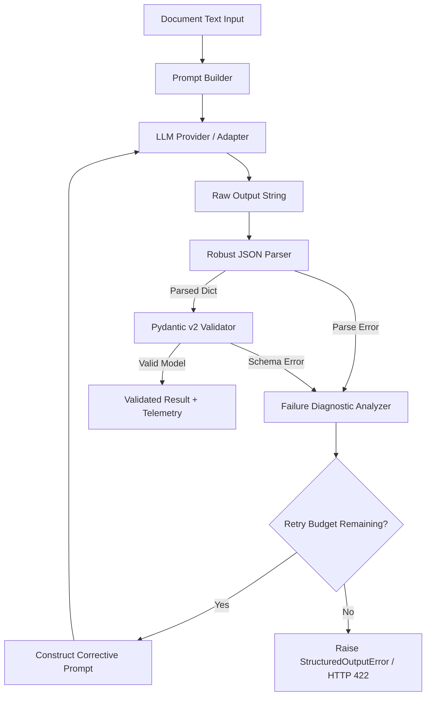

# Structured Output Agent

A production-grade Python system and FastAPI demonstration service that converts unreliable LLM outputs into validated, type-safe Pydantic models with intelligent corrective retries, comprehensive telemetry, and provider abstraction.

---

## Problem

Large Language Models generate probabilistic, semi-structured natural language. However, downstream enterprise software—such as transactional databases, accounting systems, payment gateways, and ERPs—requires strictly typed, deterministic, and schema-compliant data structures.

When relying on LLMs for critical tasks like document extraction:
- Models produce syntactically malformed JSON (e.g. unclosed brackets, trailing commas, markdown formatting).
- Models produce syntactically valid JSON that violates schema constraints (e.g. missing required fields, incorrect data types).
- Models produce data that violates cross-field business logic and arithmetic consistency (e.g. line items sum not matching subtotal, tax not matching total).

A naive `json.loads(response)` fails in production and introduces silent data corruption or unhandled runtime exceptions.

---

## Why Naive JSON Parsing Fails

1. **Markdown Fences**: LLMs frequently wrap JSON in ```` ```json ... ``` ```` blocks, which crashes standard JSON decoders.
2. **Conversational Chitchat**: Models prepend conversational text (`"Sure! Here is the extracted JSON:"`) or append commentary (`"Hope this helps!"`), making direct parsing impossible.
3. **Syntactic Slips**: Minor issues like trailing commas before closing braces (`{"items": [1, 2, ],}`) or Python-style single quotes (`{'key': 'value'}`) cause hard JSON decode errors.
4. **Silent Omissions & Hallucinations**: Even when JSON is syntactically valid, models frequently hallucinate types (e.g. `"subtotal": "one hundred"`), emit negative quantities, or produce arithmetic inconsistencies between line items and totals.

---

## Architecture

The system is designed in decoupled, observable layers:



### Core Components

- **`PromptBuilder`** (`app/agent/prompt_builder.py`): Formulates the initial extraction prompt and builds targeted corrective prompts when validation fails, telling the model *exactly* what was invalid.
- **`RobustJSONParser`** (`app/agent/parser.py`): Strips markdown code blocks, extracts JSON object boundaries, applies safe syntactic repairs (trailing commas, single quotes), and detects truncated output without being overly permissive.
- **`SchemaValidator`** (`app/agent/validator.py`): Enforces strict Pydantic v2 validation and extracts granular diagnostics (field path, error category, expected vs. received value).
- **`RetryController`** (`app/agent/retry.py`): Enforces a strict retry budget (default: 3 attempts), tracks execution history, and halts to prevent infinite loops.
- **`LLMProvider` Protocol** (`app/providers/`): Provider abstraction supporting OpenAI, Anthropic, and deterministic Mock providers.
- **Telemetry** (`app/telemetry/`): Thread-safe in-memory metric collection (`MetricsCollector`) and structured logging with `structlog`.

---

## Validation Strategy

We use **Pydantic v2** backed by `pydantic-core` (Rust) for zero-overhead validation and strict type safety:

1. **Strict Types & Forbid Extra Keys**: All models use `model_config = ConfigDict(extra="forbid", str_strip_whitespace=True)` to prevent hallucinated fields from polluting data pipelines.
2. **Field-Level Validation**:
   - `quantity` must be strictly positive (`gt=0`).
   - `unit_price`, `total`, `subtotal`, and `tax` must be non-negative (`ge=0`).
   - For each line item: `round(quantity * unit_price, 2) == round(total, 2)`.
3. **Cross-Field Model Invariants**:
   - `subtotal` must equal the sum of all line item totals: `abs(sum(item.total) - subtotal) <= 0.05`.
   - `total` must equal `subtotal + tax`: `abs((subtotal + tax) - total) <= 0.05`.
   - `due_date >= invoice_date`.

---

## Retry Strategy

When validation fails, the agent does **not** blindly resend the original prompt. Instead, it constructs a **targeted corrective prompt**:

1. **Analyze Failure**: Identifies whether the failure was a `JSONParseError` (syntax/truncation) or a `SchemaValidationError` (missing field, type error, math mismatch).
2. **Build Corrective Feedback**:
   - Explains the exact failure: e.g. `- Field 'total': Total (150.00) does not match subtotal (100.00) + tax (20.00) = 120.00 (received: 150.0)`.
   - Reminds the model of schema requirements and math invariants.
   - Instructs the model to return *only* the corrected JSON object.
3. **Enforce Retry Budget**: Defaults to a maximum of 3 attempts. Capping retries prevents infinite token spend, guarantees API latency bounds, and avoids repetitive hallucination loops.
4. **Structured Output Error**: If all attempts are exhausted, the agent raises `StructuredOutputError`, containing the full attempt history and error details. The API maps this to `422 Unprocessable Content`.

---

## Example

### Input Text:
```text
INVOICE
Invoice Number: INV-2024-8841
Invoice Date: 2024-04-10
Due Date: 2024-05-10
Supplier: Apex Cloud Technologies Inc. (US-99482104)
Customer: Northwind Dynamics LLC (US-11029384)
Currency: USD
Items:
1. Dedicated GPU Cluster (H100) - 2.0 units @ $1200.00 = $2400.00
2. High-Performance Storage (10TB) - 1.0 units @ $350.00 = $350.00
Subtotal: $2750.00
Tax: $226.88
Total: $2976.88
```

### Extracted Validated Output:
```json
{
  "invoice_number": "INV-2024-8841",
  "supplier": {
    "name": "Apex Cloud Technologies Inc.",
    "tax_id": "US-99482104",
    "address": null,
    "email": null
  },
  "customer": {
    "name": "Northwind Dynamics LLC",
    "tax_id": "US-11029384",
    "address": null,
    "email": null
  },
  "invoice_date": "2024-04-10",
  "due_date": "2024-05-10",
  "currency": "USD",
  "line_items": [
    {
      "description": "Dedicated GPU Cluster (H100)",
      "quantity": 2.0,
      "unit_price": 1200.0,
      "total": 2400.0
    },
    {
      "description": "High-Performance Storage (10TB)",
      "quantity": 1.0,
      "unit_price": 350.0,
      "total": 350.0
    }
  ],
  "subtotal": 2750.0,
  "tax": 226.88,
  "total": 2976.88
}
```

---

## Failure Example

If a model returns valid JSON with an arithmetic mismatch:
```json
{
  "subtotal": 500.0,
  "tax": 50.0,
  "total": 999.0
}
```

The system intercepts the failure:
```text
[warning] Schema validation failed attempt=1 error_type=SchemaValidationError errors_count=1
```
And sends the following corrective prompt:
```text
Your previous response in attempt 1 was invalid and rejected by the validator.

Schema Validation Errors:
- Field 'root': Total (999.00) does not match subtotal (500.00) + tax (50.00) = 550.00

Correct the issues identified above. Ensure all required fields are present, types are correct,
and all mathematical constraints hold.
```

---

## Local Setup

### 1. Clone & Install
```bash
git clone <repo-url>
cd valid_json_Agent

# Create virtual environment
python3 -m venv .venv
source .venv/bin/activate

# Install package and development dependencies
pip install -e ".[dev]"
```

### 2. Run API Server
```bash
uvicorn app.main:app --host 0.0.0.0 --port 8000 --reload
```

---

## Docker

Run the service via Docker Compose:
```bash
docker compose up --build
```
Or build and run directly with Docker:
```bash
docker build -t structured-output-agent .
docker run -p 8000:8000 structured-output-agent
```

---

## API Endpoints

### `POST /v1/extract`
Extract structured invoice from text.

**Request:**
```bash
curl -X POST http://localhost:8000/v1/extract \
  -H "Content-Type: application/json" \
  -d '{
    "document_text": "Invoice Number: INV-001\nSupplier: Acme...",
    "provider": "mock"
  }'
```

**Response (200 OK):**
```json
{
  "data": { ... },
  "attempts": 1,
  "request_id": "c1f7b9e2-9b24-4f01-9a91-4560d2b99201",
  "duration_ms": 1.45
}
```

### `GET /health`
Service health check.
```bash
curl http://localhost:8000/health
```

### `GET /metrics`
Operational telemetry report.
```bash
curl http://localhost:8000/metrics
```

---

## Metrics

Operational metrics tracked in real-time by `MetricsCollector`:

| Metric | Description |
|---|---|
| `total_requests` | Total extraction requests received |
| `successful_validations` | Requests successfully validated |
| `failed_validations` | Requests that failed after exhausting retries |
| `average_retries` | Average attempts required per request |
| `retry_distribution` | Count of requests resolved on attempt 1, 2, 3, etc. |
| `final_failure_rate` | Ratio of final failures to total requests |
| `validation_failure_categories` | Breakdown of failure categories (`json_syntax`, `missing_field`, `type_error`, `math_mismatch`) |

---

## Testing

The test suite runs 100% deterministically and offline without requiring API keys:

```bash
# Run pytest suite
pytest -v --durations=10

# Run lint and formatting check
ruff check .
ruff format --check .

# Run static type checking
mypy app
```

---

## CLI

An optional command-line interface is provided for quick document extraction:

```bash
# Extract using default mock provider
python -m app.cli extract tests/fixtures/invoice_valid.txt

# Extract using OpenAI provider
OPENAI_API_KEY="sk-..." python -m app.cli extract invoice.txt --provider openai --model gpt-4o-mini
```

---

## Limitations

1. **Document Token Limits**: The current implementation accepts plain text documents. For documents exceeding LLM context windows, upstream chunking or document pre-processing is required.
2. **Text-Only Ingestion**: Does not include native optical character recognition (OCR) for scanned PDFs or images. Assumes text has already been extracted.

---

## Future Improvements

1. **Token Cost Tracking**: Track cumulative prompt and completion token costs per extraction request in metrics.
2. **Multi-Domain Schema Registry**: Extend the agent to dynamically register schemas (resumes, job postings, purchase orders) via a schema registry.
3. **Dead-Letter Queue (DLQ)**: Automatically push failed documents directly to an SQS/Kafka dead-letter queue for human review.

## Concurrent API operation

The API owns one HTTPX connection pool per worker, reused across requests and
corrective attempts and closed on shutdown. CLI and standalone provider calls
retain their own short-lived clients. Provider instances remain request-local.

| Environment variable | Default | Purpose |
| --- | --- | --- |
| `MAX_CONCURRENT_EXTRACTIONS` | 16 | Active extractions per worker |
| `ADMISSION_TIMEOUT_SECONDS` | 1 | Maximum wait for a worker slot |
| `MAX_HTTP_CONNECTIONS` | 32 | Connections in each worker's upstream pool |
| `REQUEST_TIMEOUT_SECONDS` | 30 | HTTP operation timeout |
| `EXTRACTION_TIMEOUT_SECONDS` | 90 | Overall extraction deadline across retries |

Overload returns HTTP 503 with `Retry-After: 1`. The overall deadline returns
HTTP 504 and releases the worker slot. Documents are limited to 100,000 characters
by the API schema; apply a body-size limit at your reverse proxy as well to bound
request decoding memory. Settings reject nonpositive capacity and timeout values.

Run multiple workers or replicas behind a load balancer to increase capacity.
These limits and `/metrics` counters are process-local, so total upstream load
scales with worker count. Use an external queue and shared quota store if you need
durable background jobs or a deployment-wide limit. This change does not introduce
those services or guarantee upstream provider capacity.
